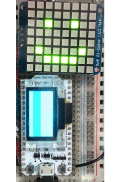
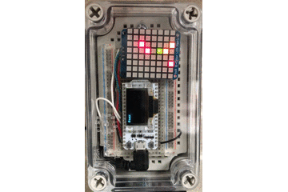
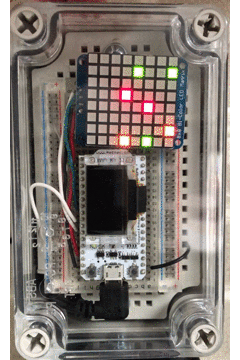
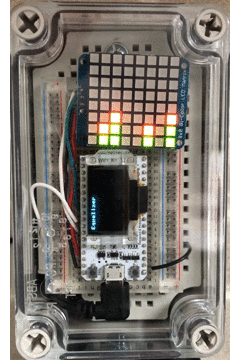
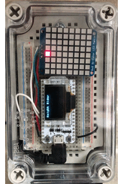

# Christmast Gift 2019

For my gift to my kids this year I decided to build them something to keep with them.  It started out as a simple GIF viewer and ended up with something more visually fun/nostalgic.

There are different modes to the display, after startup the user can select a different mode by pressing a pushbutton on the top of the box:

1. GIF Animation - My character drawing is animated while the LED display shows a Happy Face

   

2. Gaze - A star-like animation on the LED display

   

3. Worm Race - There are 3 worms that race to the top, the first one to the top wins (then restarts the game)

   

4. Equalizer - Simulates an audio equalizer

   

5. Police Scanner - Simulates an LED police scanner

   

6. Knight Rider - Tribute to Kitt

   

## Parts Used

* [MakerFocus ESP32](https://www.amazon.com/dp/B076KJZ5QM/ref=cm_sw_em_r_mt_dp_U_OA4jEbJS5QETJ)
* [Adafruit Bicolor LED Matrix](https://www.adafruit.com/product/902)
* [Half-sized Breadboard](https://www.adafruit.com/product/64)
* [Project Case](https://www.amazon.com/gp/product/B07H5D6Q1Y/ref=ppx_yo_dt_b_asin_title_o02_s00)
* [Panel Mount Micro USB Cable](https://www.amazon.com/gp/product/B07LB4F9V7/ref=ppx_yo_dt_b_asin_title_o02_s01)
* [Micro USB Extension Cable](https://www.amazon.com/gp/product/B06Y42W4FQ/ref=ppx_yo_dt_b_asin_title_o04_s00)